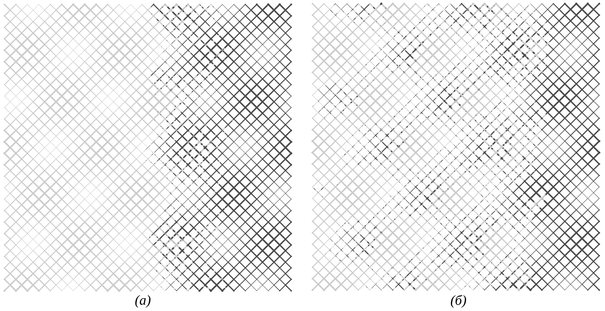
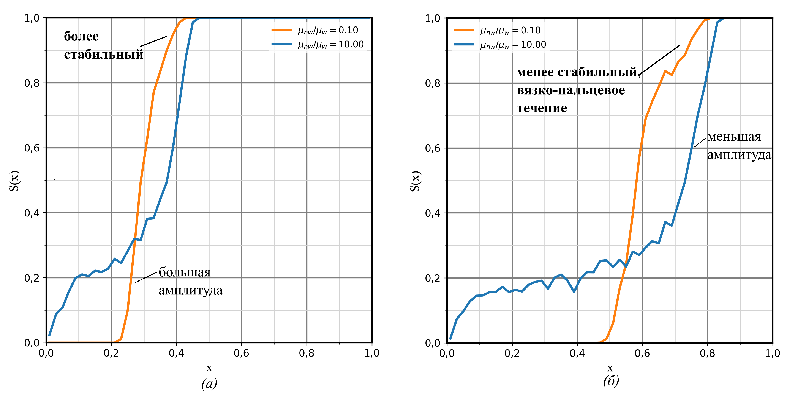
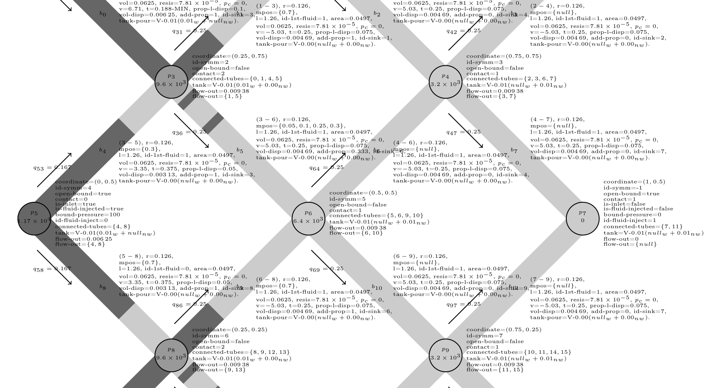

# network-model
A network model for simulating two phase flow in porous media.

## Tasks for future:

### Simulations to conduct
1. __Viscosity with random tube-radii__: see how viscous fingering happens there, start in a prefilled system.
### Debug
- __Viscosity ratio__: check if the viscosity values are correctly being used to generate tube resistance table.
- __Multiple contact__: check if multiple contact meniscii are only created in case of alternating fluids and not created in case of same fluids.

### Manual
The manual explains purpose on why the modifications and complexities were added.
- __Geometry skew__: in unskewed the variance of radii along x axis periodically changes, this causes noticeable oscillations on the S(x) plots. These oscillations are suppressed by skewing along the x axis.
- __Linear Equations:__ Compare performance difference between: gaussian-elimination,  Eigen::SimplicialLLT<Eigen::SparseMatrix<double>, and iterative solvers. Since the ratio between the resistances can be very high, the matrix maybe ill-conditioned.
- __Multiple Meniscii Contact__: As soon as wetting fluid reaches a node, it creates a meniscii with other tubes with non-wetting fluid. Study in imbibition, isolated block whether it works or not.
- __Multiple contact and collapse__: Study multiple contact and odd-vs-even number-of-meniscii in creating extra pressure desired from multiple meniscii contact.
- __Meniscii recombination__: Study all possible types of recombinations and what effect they have on general $$S(x)$$ plots.
- __Zero point__: Study whether changing the node of fixed pressure affects geometry or not.

### Features to add:
- __Separate concurrent plotter__:
    - A plotting software is needed for:
        1. changing colors without repeating computation,
        2. not wasting computation time -- plotting images, while performing the computation.
    - Features:
        1. The plotting software and the simulate software is run simultaneously, every time the plotting software detects a new simulation output, it starts processing.
        2. The plotting software recalculates the velocities from the pressure values and checks the accuracy.

- __Using multiple cores__:
    - What could be speed-up:
        1. Tube resistance and capillary pressure values -- for-loops going through all tubes.
    - How is here: (demo-openmp)[https://github.com/kafishabbir/demo-openmp]

- __Initial conditions__:
    1. Takes in dst::Parameter, and output a completely processed state.
    2. Boundary type of the nodes are assigned by ic.
    3. Class hierarchy such that there are tools such as counting boundaries which are used by both initial-conditions-generator and the main simulate.
    
## Packages required:
### Eigen
For solving sparse linear equations.
##
    sudo apt install libeigen3-dev
    
### Cairo
For flow visualizations.
##
    sudo apt install libcairo2-dev
    
### nlohmann-json
For output data.
##
     sudo apt install nlohmann-json3-dev
     
## Using
In the root folder for example network-model/
##
    make

##
    cd run/results/flow
    
##
    make
    
This will create
- run/results/flow/flow.pdf: file with all images labeled with simulation parameter, measurements, and network properties.
- run/build/xxx_yyy.o: all the object files
- run/results/: the other results
- run/simulate.exe: the executables are produced here

It is not necessary to create any folders or run the main executable, it is handled by the make command. However, if it is necessary to execute, in network-model:

##
    ./run/simulate.exe
    
## Example results

Two phase drainage displacement. Initial wetting fluid is being displaced by non-wetting fluid (lighter color), at $$t = 0.6$$.
- (a), the viscosity of the invading fluid is lower, and it is producing a large S(x) shock amplitude. 
- (b), the viscosity of the invading fluid is higher, there is residue wetting fluid, and the amplitude is smaller.

The shock front for lower-viscosity-invading-fluid is more stable in the beginning, and it gets less stable towards the end. While the shock profile for higher viscosity ratio remains same:
- (a) at $$t = 0.3$$, and
- (b) $$t = 0.6$$

Flow visualization as a vector image with extensive details for debug purpose.
